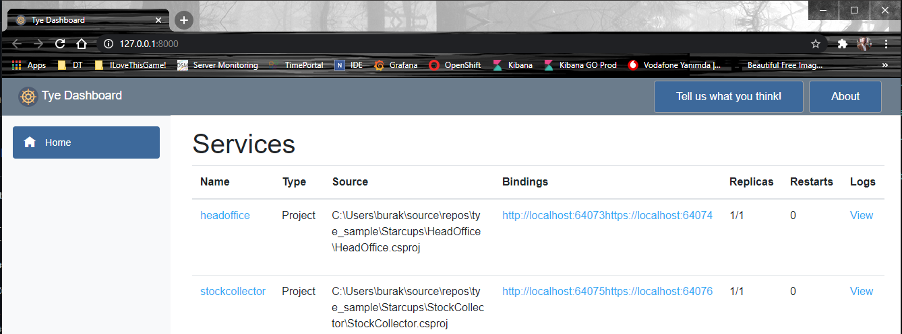
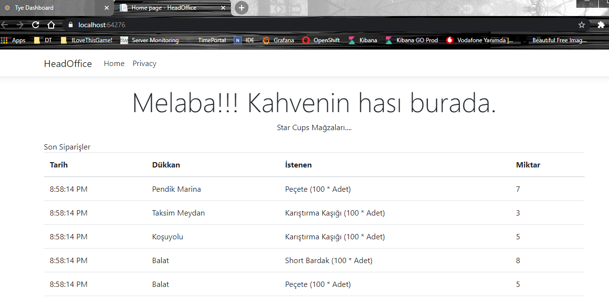
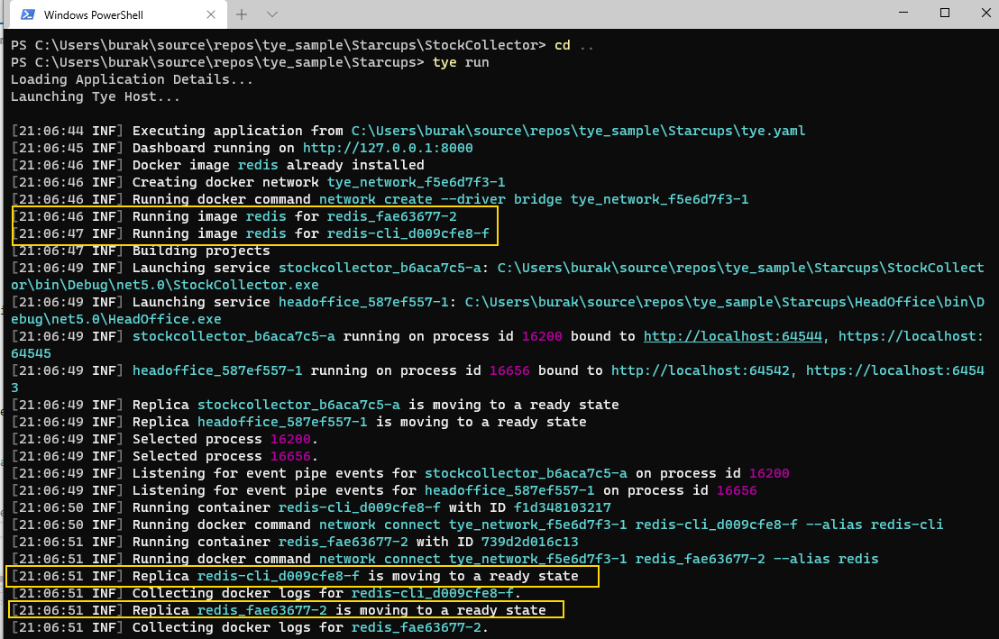
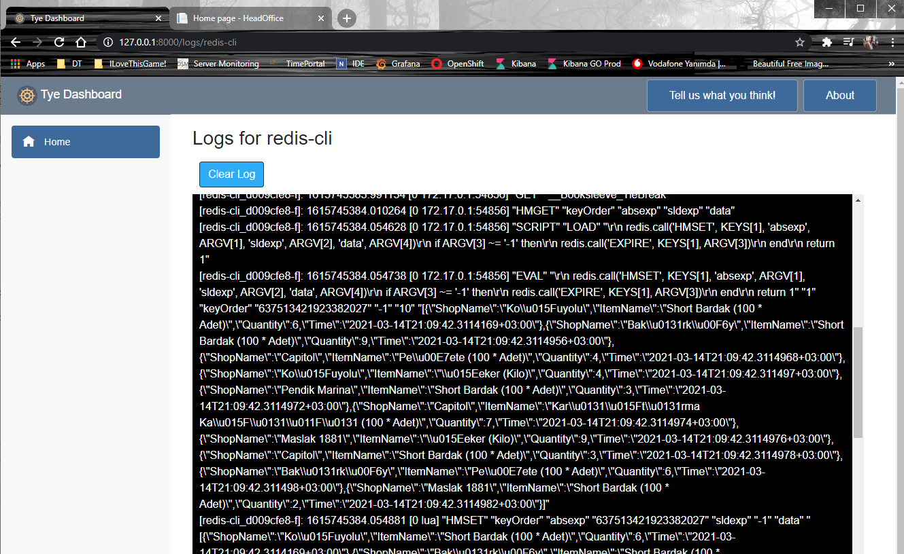
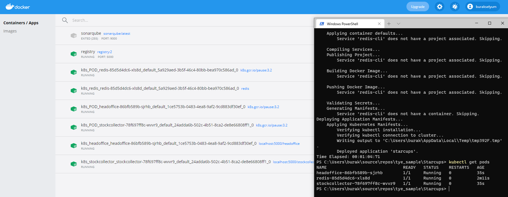
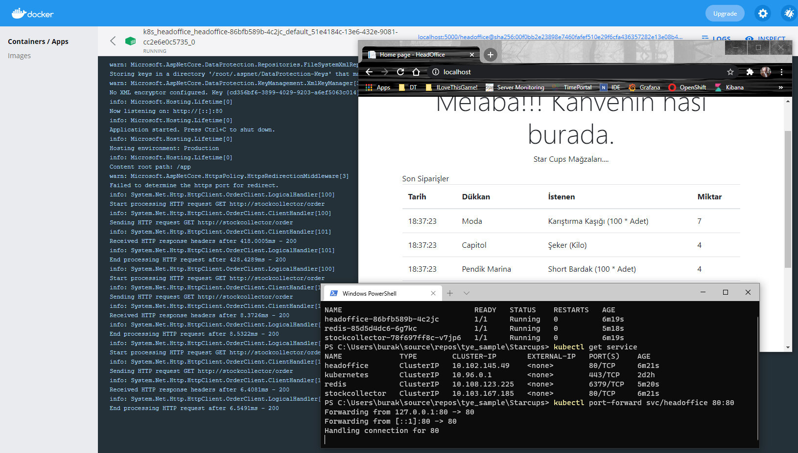

# Örnek Tye Uygulaması

Demoda bir frontend, bir backend birde Redis mevzu bahis. Starcups isimli bir kahve firması var. HeadOffice isimli web arayüzünden İstanbul'un semtlerdeki kahve dükkanlarından gelen malzeme taleplerini görebiliyoruz. 
Malzeme bilgileri StockCollector isimli RestAPI servisi üstünden geliyor. Redis, StockCollector'un çektiği veriyi belli süre cache'lemek için sisteme dahil edilmiş durumda. 

Amaç, Tye aracı ile bu servislerin kolayca ayağa kaldırılması, zahmetsizce dockerize edilmesi, loglarına bakılması, çevre değişkenlerinin yaml bazlı yönetilmesi ve Kubernetes tarafına en basit şekliyle Deploy edilmesi gibi işlemlerin incelenmesi.

_Platform : Windows 10_

## Gerekenler

```
# Sisteme tye yüklemek için aşağıdaki terminal komutu kullanılabilir(Son sürüme bakmak lazım. Sonuçta bu şimdilik deneysel bir proje)
dotnet tool install -g Microsoft.Tye --version "0.5.0-alpha.20555.1"

# Kubernetes deployment öncesi Service Discovery için kullanacağımız local registry
docker run -d -p 5000:5000 --restart=always --name registry registry:2

# Docker Desktop tarafında Enable Kubernetes seçeneğinin de işaretli olması lazım
# Kubernetes'in etkin olduğunu anlamak içinse aşağıdaki komut işletilebilir
kubectl config current-context
# Bize docker-desktop cevabını vermeli
```

## Projenin İnşası

Temel klasör operasyonları ve kodlama ile başlayalım.

```bash
mkdir Starcups
cd Starcups
# Bir tane frontend uygulaması. Razor tipinde.
dotnet new razor -n HeadOffice
# frontend'in konuşacağı bir WebAPI
dotnet new webapi -n StockCollector
dotnet new sln
dotnet sln add HeadOffice StockCollector

# Şu haldeyken tye ile çalıştırıp localhost:8000 adresine gidilebilir. İki uygulama da Dashboard üstünde görünür ve ayrı ayrı incelenebilir.
tye run

# WebAPI tarafında OrderData sınıfı eklenir ve WeatherForecastController, OrderController olarak değiştirilip işlenir.

# HeadOffice uygulamasının çevre değişkenlere göre StockCollector'a erişmesi için aşağıdaki paket eklenir
cd HeadOffice
dotnet add package --prerelease Microsoft.Tye.Extensions.Configuration
cd ..

# HeadOffice isimli frontEnd uygulamasından REST çağrısını yapmak için OrderData ve OrderClient sınıfları ilave edilir.
# HeadOffice'deki Index.cshtml(cs ile birlikte) düzenlenir.

# Çevre konfigurasyon ayarlamaları için tye.yaml dosyası ilave edilir.
tye init

# Tekrar çözüm çalıştırılır ve tarayıcı ile gidilir. 
tye run
```






Önyüz, servisi kullanabilir hale geldi. Şimdi servisin ürettiği veriyi bir süre cache'leyecek bir servisi işin içerisine katacağız. Bunun için Redis'ten yararlanabilir.
Redis desteği'ni de yaml dosyaları ile yöneteceğiz.

```bash
# Öncesinde StockController için Redis paketini ilave edelim.
cd StockController
dotnet add package Microsoft.Extensions.Caching.StackExchangeRedis
cd ..

# Sonrasında OrderController sınıfında yeni bir Get metodu yazacağız.
# ve Redis için ConfigureService metodunda gerekli düzenlemeyi yapmalıyız.

# Örnek Redis eklenmiş haliyle de bir çalıştırılır ve 10 saniyelerde bir cache'in düşüp yeni bilgilerin getirildiği gösterilir.
tye run
```






Kubernetes deployment işlemine geçmeden önce redis için ayrı bir yaml dosyasının eklenmesi gerekir. Bu dosya içeriği hazırlandıktan sonra ise aşağıdaki komutla redis'in kubernetes üzerine alınması sağlanır.

```bash
kubectl apply -f redis.yaml
```
Sonrasında Service Discovery için gerekli bildirimin tye.yaml dosyasına eklenmesi gerekir. Local Registry yerine DockerHub, Azure Container Registry' de kullanılabilir. Ya da muadillerinden birisi.

Kubernetes deployment işlemi için aşağıdaki komutla ilerlenir. Harici bir servis olarak Redis kullandığımız için ona hangi adresle erişeceğimiz sorulur. Soruyu "redis:6379" şeklinde cevaplayıp ilerleyebiliriz.

```bash
tye deploy --interactive

kubectl get pods
```



Aşağıdaki komutlar ile kubernetes deployment ve pod durumları kontrol edilir.

```bash
kubectl get deployment
kubectl get svc
kubectl get secrets
kubectl get pods
```

Web arayüzüne erişmek için port-forward uygulamak gerekebilir. _(Cluster dışından erişmek istediğimiz için)_

```
kubectl port-forward svc/headoffice 80:80
```

Sonrasında localhost:80 adresine gidilirse web önyüzüne ulaşılabilir.



K8S dağıtımını kaldırmak için aşağıdaki komut kullanılabilir.

```bash
tye undeploy
```

Kaynak : [Introducing Project Tye](https://devblogs.microsoft.com/aspnet/introducing-project-tye/)